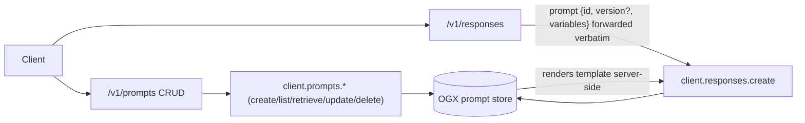
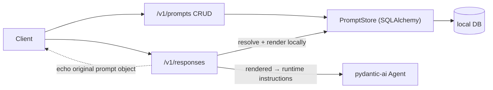
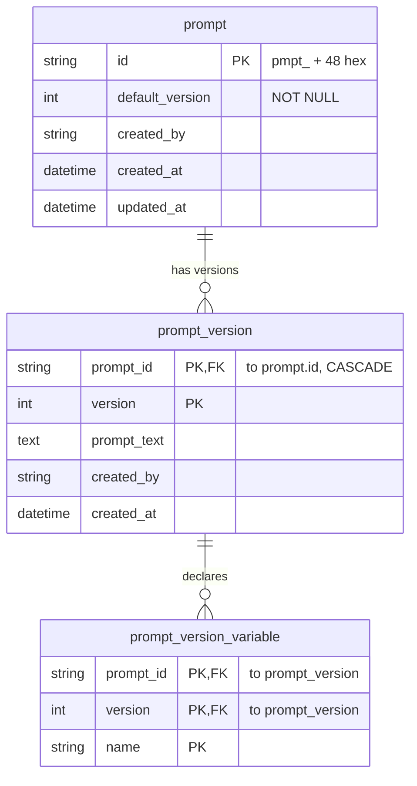
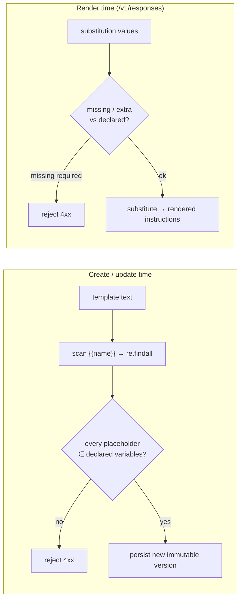
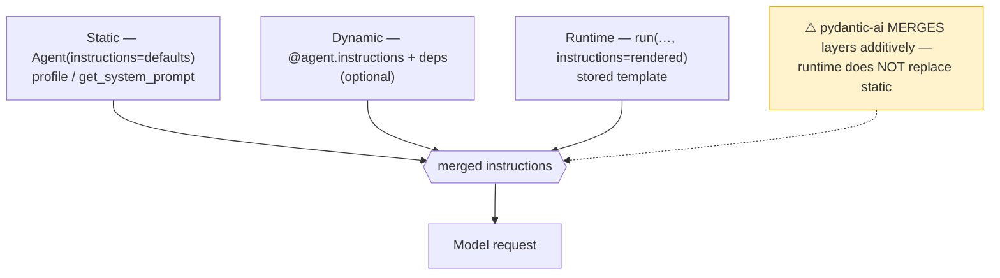
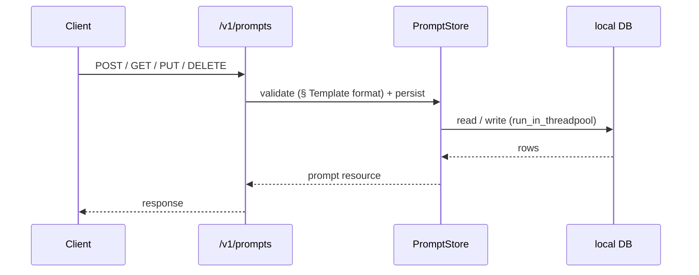
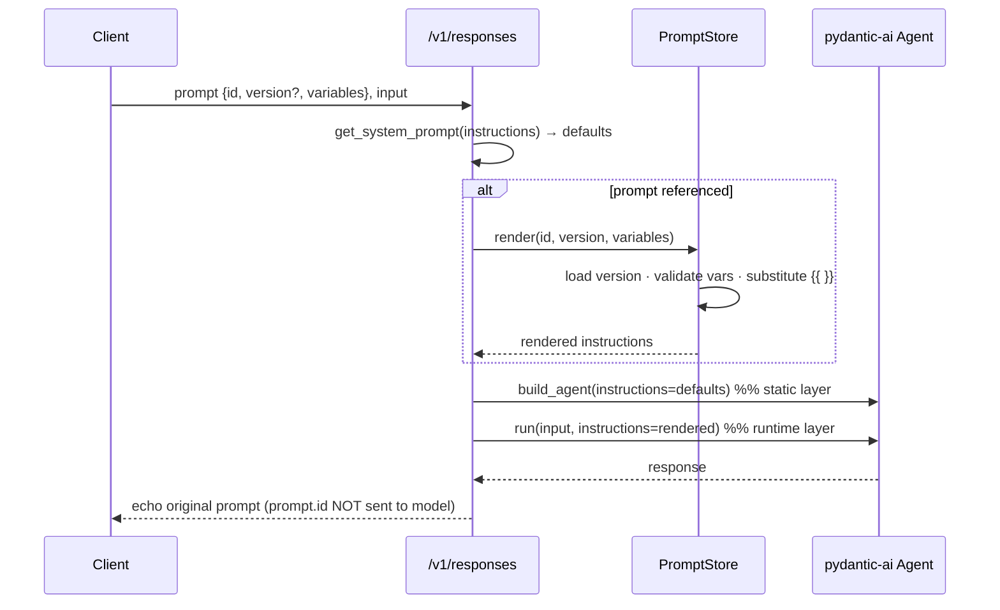

# Prompts API migration to pydantic-ai

## Metadata

- **Author:** Andrej Šimurka, Anik Bhattacharjee
- **Created:** 2026-09-25
- **Tracking:** [UIESTRAT-216: Inference backend migration](https://redhat.atlassian.net/browse/UIESTRAT-216)

## Objective

After OGX removal, LCORE owns a local, versioned prompt store behind `/v1/prompts`;
when `/v1/responses` references a stored `prompt: { id, version?, variables? }`,
LCORE loads and renders the template and passes the result to the agent as
**runtime instructions** — never as `output_type`, and never forwarded to a backend
prompt store.

## Background

Today both halves of the Prompts API are backed entirely by OGX. The CRUD endpoint
`src/app/endpoints/prompts.py` is a thin proxy — its docstring literally says
"manage **OGX** stored prompt templates" — forwarding to `client.prompts.*`
(`create` / `list` / `retrieve` / `update` / `delete`). LCORE stores nothing; it
does only a Pydantic shape check plus a `check_suid_prompt(prompt_id)` format check
before forwarding the payload verbatim. OGX owns all semantic validation, versioning,
and the `pmpt_…` id generation.

On the responses side, the `prompt` field is **aliased directly from OGX**
(`OpenAIResponsePrompt` in `ogx_api.openai_responses`) and passed straight through:
`responses.py` never renders `{{ }}` placeholders — it hands `prompt` to
`client.responses.create(...)` and OGX expands the template server-side.



When OGX is removed, LCORE must own the whole lifecycle: store templates and their
version history locally, reimplement create/update validation, **generate** `pmpt_`
ids, resolve + render a referenced prompt at request time, and inject the rendered
text into the pydantic-ai agent — while keeping the public API shape unchanged so
existing clients keep working.



## Goals

- **Keep the public API shape** — `/v1/prompts` CRUD and `responses.prompt` —
  byte-compatible so existing clients need no changes; only the storage and
  resolution owner moves into LCORE.
- **Local versioned store**: immutable version history with a per-template default
  version, owned by LCORE's database.
- **Reimplement OGX's validation** (Mustache placeholder scan + declared-variables
  rule + id format) at create/update time, plus a render-time check for
  missing/extra substitution values.
- **Render locally and inject as runtime instructions** into the agent, keeping
  LCORE profile/deployment defaults as the agent's static instructions.
- **Never leak `prompt.id` to the model wire** after cutover, and always echo the
  client's original `prompt` object on the HTTP response.

## Non-goals

- **Jinja / control-flow templates** (``, loops, filters, dotted paths).
  The Prompts API stays Mustache-only for OpenAI compatibility. (rlsapi's separate
  Jinja2 system-prompt path is unrelated — see Architecture → Template format.)
- **Mapping stored prompts to `output_type` / `PromptedOutput`.** Those shape the
  *return value*; a stored prompt is a *system-instruction* template.
- **Migrating the separate `saved_prompts` feature** (user-owned free-text prompts).
  It is already LCORE-owned and out of scope here — though its DB module is the
  pattern we mimic.
- **Content-object substitution values** (`input_image` / `input_file`) in the first
  cut — text-only render initially (see Open issues).

## Prompt resource

A stored prompt is a **versioned system-instruction template**, managed by
`/v1/prompts` and referenced on `/v1/responses`. It is distinct from two neighbors:

- **vs. `instructions`** — same system channel after render, but `instructions` is
  inline for a single request; a stored prompt is a reusable `id` + optional
  `{{placeholders}}`.
- **vs. `saved_prompts`** — a genuinely different feature (user-scoped free text,
  uuid4 ids, no versions or variables). Do not conflate.

**The CRUD shape and the responses-reference shape are not the same object.**

| Context | Field | Shape |
|---|---|---|
| CRUD (`/v1/prompts`) | `prompt` | template text `str` |
| CRUD (`/v1/prompts`) | `variables` | **declared names** `list[str]` |
| CRUD (`/v1/prompts`) | `version` | `int` (≥ 1) |
| Responses (`responses.prompt`) | `variables` | **substitution values** `dict[str, content]` |
| Responses (`responses.prompt`) | `version` | `str | None` |

Reference payload on `/v1/responses`:

```json
{
  "prompt": {
    "id": "pmpt_…",
    "version": "1",
    "variables": {
      "role":  { "type": "input_text", "text": "Kubernetes expert" },
      "topic": { "type": "input_text", "text": "OpenShift" }
    }
  }
}
```

## Architecture

### What changes when OGX is removed

| Concern | Today (OGX) | After (LCORE-owned) |
|---|---|---|
| CRUD storage | `prompts.py` → `client.prompts.*` | `prompts.py` → local `PromptStore` (SQLAlchemy) |
| Create/update validation | inside OGX | reimplemented in LCORE (Template format below) |
| `pmpt_` id | generated by OGX | **generated by LCORE** (`check_suid_prompt` validates; needs a generator) |
| `responses.prompt` | forwarded to OGX for server-side expansion | LCORE resolves + renders; **strip `prompt` from outbound model params** |
| HTTP response | echoes client `prompt` | keep echoing client `prompt` for compatibility |
| Instructions to agent | via the OGX responses path | rendered string → pydantic-ai runtime instructions |

### Database schema

Normal form: identity, immutable versions, declared variables as child rows. The
default version is a **column on `prompt`**, not a denormalized flag on every version
row. This mirrors the existing `SavedPrompt` local-DB pattern (SQLAlchemy 2.0 typed
`Mapped` / `mapped_column`, composite PKs, `ForeignKey(ondelete="CASCADE")`).



An optional deferred FK `prompt (id, default_version) → prompt_version
(prompt_id, version)` enforces that the default always points at a real revision.

**API ↔ storage map:**

| API field | Storage |
|---|---|
| `prompt_id` | `prompt.id` |
| `version` | `prompt_version.version` |
| `prompt` (text) | `prompt_version.prompt_text` |
| `variables` (declared) | rows in `prompt_version_variable` |
| `is_default` | computed: `prompt.default_version == version` |

### Template format and validation

Match OGX's current rule exactly: **Mustache-style placeholders only**, validated
with the same scan OGX uses:

```python
re.findall(r"{{\s*(\w+)\s*}}", prompt_text)
```

- Placeholder form `{{name}}` (optional inner spaces `{{ name }}`).
- Name must match `\w+` (letters, digits, underscore).
- Every placeholder in the text must appear in declared `variables`.
- Declared-but-unused names are allowed.
- **Not Jinja**: no ``, filters, loops, or dotted paths.

Validation runs at two moments:



> **Note.** `src/app/endpoints/rlsapi_v1.py` renders *its* system prompt with Jinja2
> in a `SandboxedEnvironment`. That is a separate path and format; the Prompts API
> stays Mustache-only.

### Injecting into pydantic-ai agents

pydantic-ai 2.27.1 supports three instruction layers:

| Layer | API | Use in LCORE |
|---|---|---|
| Static | `Agent(instructions=…)` | Profile / deployment defaults (stable cache prefix) |
| Dynamic | `@agent.instructions` + deps | Optional; long-lived agents resolving from the store |
| Runtime | `agent.run(…, instructions=…)` | **Preferred** for per-request stored templates |

We will keep LCORE defaults on the `Agent` as **static** instructions, and pass
the rendered stored template as **runtime** instructions on `run` /
`run_stream_events`. The same helper serves responses, query, streaming, and A2A.



```python
# defaults only (profile / get_system_prompt)
agent = build_agent(client, responses_params_with_defaults, config)

rendered = await prompt_store.render(
    prompt_id=request.prompt.id,
    version=request.prompt.version,
    variables=request.prompt.variables,
)

# pass the template as runtime instructions for THIS run —
# do not flatten it into the Agent(...) constructor
await agent.run(user_prompt, instructions=rendered)
# or: async with agent.run_stream_events(user_prompt, instructions=rendered)
```

Today `build_agent` already does `Agent(..., instructions=responses_params.instructions)`.
The migration splits "defaults" (static) from "referenced template" (runtime) instead
of flattening both into the constructor.

**Implementation note:** Avoid mapping stored prompts to `output_type` / `PromptedOutput`; using
`system_prompt` (history/reinjection pitfalls); forwarding `prompt.id` to the model
transport after cutover; stuffing the template into constructor instructions and
losing the static/runtime split.

## End-to-end flows

### CRUD



### Use on `/v1/responses`



## Alternatives considered

### Variables: child table vs. JSON column

| Option | Pros | Cons |
|---|---|---|
| **Child table `prompt_version_variable` (chosen)** | Uniqueness/query constraints in the DB; parity with create-time validation | Extra table + joins |
| JSON column on `prompt_version` | Fewer joins, simpler schema | Weaker uniqueness/query guarantees; validation lives only in app code |

**Chosen: child table**, for validation parity and constraint enforcement.

### Instruction channel: `instructions` vs. `system_prompt`

pydantic-ai still supports both. We use `instructions` (static + runtime) because
`system_prompt` carries history/reinjection semantics that don't fit a
per-request rendered template. `output_type` / `PromptedOutput` is not an
alternative — it shapes outputs, not the system channel.

## Open issues

- **Prompt data continuity at cutover.** Existing prompt templates
  live in **OGX's** store, keyed by OGX-generated `pmpt_` ids; LCORE's new tables
  start empty. A client that saved `pmpt_abc…` before cutover and references it on
  `/v1/responses` after gets a 404 unless the data is moved — Discussion needs to be
  had to decide if a **one-shot export/import** that from existing OGX database that preserves ids and versions is required — if required: 
    * the id generator in the new database must accept externally-supplied ids, not only mint new ones.
    *  **`version` type mismatch.** CRUD models version as `int`; the OGX-aliased
  responses reference types it as `str | None`. 
- **Substitution value types.** Responses `variables` are `dict[str, content]`
  (`input_text` / `input_image` / `input_file`). Template substitution is a string
  operation, so only `input_text` has a well-defined meaning. Initial behavior:
  substitute `input_text` values and **reject `input_image`/`input_file` with a
  4xx**. Supporting non-text content (routing it into request input parts) is
  deferred pending a real use case.


## Implementation timeline

- **Milestone 1 — storage.** SQLAlchemy models for the three tables + wire into
  `create_tables()`; add the `pmpt_` id generator.
- **Milestone 2 — `PromptStore`.** create / list / get / update (new version) /
  delete / render, mirroring `utils/saved_prompts.py` `run_in_threadpool` helpers.
- **Milestone 3 — validation.** Port OGX's placeholder scan + declared-vars rule +
  id-format check; add render-time missing/extra checks.
- **Milestone 4 — rewire CRUD.** Point `app/endpoints/prompts.py` at `PromptStore`,
  off `AsyncOgxClientHolder`.
- **Milestone 5 — responses integration.** Resolve `request.prompt` → runtime
  instructions; strip `prompt` from outbound model params; echo on the HTTP response.
  Same helper for query / streaming / A2A.
- **Milestone 6 — tests.** Validation edge cases, versioning/default, render
  missing-vars, and the agent-injection path.

## Appendix

### Valid / invalid template examples

Valid:

```json
{ "prompt": "You are a {{role}}. Focus on {{topic}}.", "variables": ["role", "topic"] }
{ "prompt": "Summarize: {{ text }}", "variables": ["text"] }
{ "prompt": "You are a helpful assistant. Be concise.", "variables": [] }
{ "prompt": "Hello {{name}}", "variables": ["name", "unused_extra"] }
```

Invalid / edge cases:

| Case | Example | Why |
|---|---|---|
| Undeclared var | `"Hi {{role}}"`, `variables: []` | `role` not declared |
| Hyphen in name | `{{user-name}}` | `-` not in `\w` |
| Dotted path | `{{user.name}}` | not a single `\w+` token |
| Single braces | `{name}` | literal text, not a placeholder |
| Jinja control | `…` | unsupported format |
| Empty prompt | `""` | rejected by request model (`min_length=1`) |

### Key code references

- `src/app/endpoints/prompts.py` — CRUD proxy (`client.prompts.create/list/retrieve/update/delete`)
- `src/models/api/requests/responses_openai.py` — `prompt` aliased from `ogx_api.openai_responses.OpenAIResponsePrompt`
- `src/models/common/responses/responses_api_params.py` — `prompt` on `ResponsesApiParams`
- `src/app/endpoints/saved_prompts.py`, `src/models/database/saved_prompts.py`, `src/utils/saved_prompts.py` — the local-DB pattern to mimic
- `src/models/database/base.py`, `src/app/database.py` — `Base`, engine/session, `create_tables()`
- `src/utils/suid.py` — `check_suid_prompt` (`pmpt_` + 48 hex)
- `src/utils/prompts.py` — `get_system_prompt`
- `src/app/endpoints/rlsapi_v1.py` — separate Jinja2 system-prompt path

### Doc links

- pydantic-ai: [Instructions & system prompts](https://pydantic.dev/docs/ai/core-concepts/agents/)
- pydantic-ai: [Message history / part types](https://pydantic.dev/docs/ai/core-concepts/message-history/)
- pydantic-ai: [Structured output (`output_type` / `PromptedOutput`)](https://pydantic.dev/docs/ai/output/)
